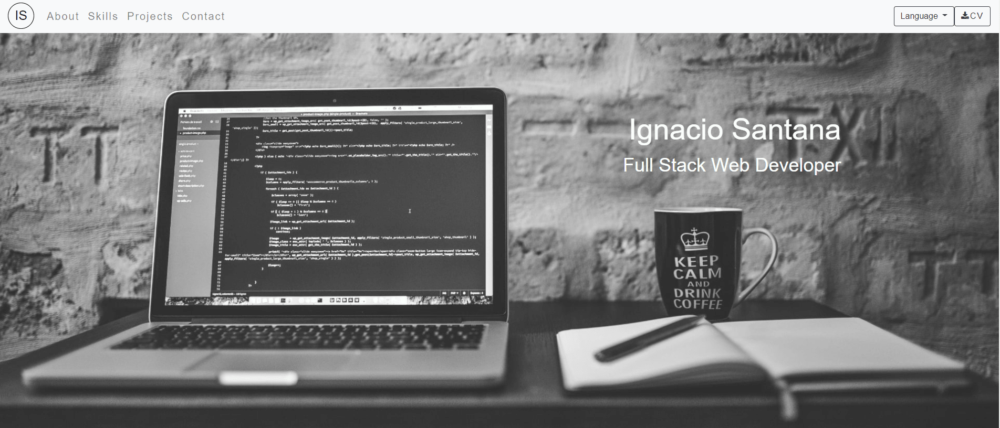
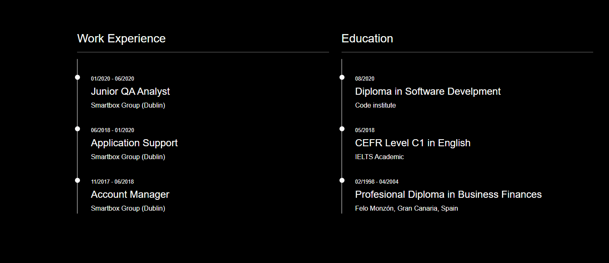
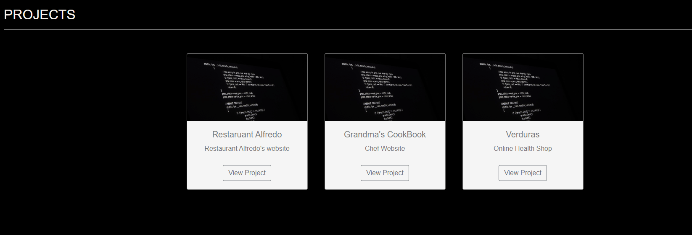

# Ignacio Santana Portfolio #

User Centric Frontend Develoment Mistone Project - Code Institute.

This is a portfolio to present to recruiters or posible employers. In this website they can find information about me (work history and education), my coding skills, three projects
that I have created, a contact form and a downloable version of my cv. The web aslo have an English and a Spanish version.

## UX ##

My target with this portfolio is to give the recuiters and the employers a quick undertanding of who I am and my experience as developer. 
And for them to have a easy and quick way to contact me. 

### User Stories ###

#### As a recruiter, I want to able to see Ignacio's resume. ####

To achive this we have include a section with a showcase of work experience and education.

And two links to download my resume. One at the top in the navbar and another one at the bottom in the footer with a link to Linkedin.

  

#### As an employer, I want to see Ignacio's work. ####

The web has a section that showcase three projects. At this stage the projects are link to the Code Insitute website, but in a near future they will be linked to real projects.
Also as showed in a previous image the footer has a link to my GitHub.

#### As a recruiter, I want to contact Ignacio after seeing his portfolio. ####

The contact section provides my email, phone number and a form for the user to send me their details and a message.

### Wireframes Mockups ###

These can be found at the link below:

https://github.com/IG30/First-Mile-Stone/tree/master/wireframes

The website has a simple style using a color scheme of black, white and grey. 

## Features ##

1. The bootstrap's navbar at the top of the page facilitate the navigation throughtout the page. It also has another bootstrap feature in it calls
spycroll that tell the user in which section the are by hightlighting the name of the section in the navbar.

2. The cards in the project section provide the user the option to view and test other projects.

3. The skill section give the user an idea of the level of my coding skills.

4. The contact section provides a form to the user in which they can contact me. 

### Features left to implement ###

1. I would like to implement more animation to the web page, in particulary to the skill section.

2. Following my progress throughtout the course I will be adding more skills and projects into the page. Now the projects are mock and the links go to the Code Institute page.

## Technologies Used ##

* HTML5 - to build the structure and layout of the page.
* CSS3 - to give the style.
* Bootstrap 4.5.0 - to get the layout running and also to help with the responsive design.

## Testing ##

1. Go to the Navbar:
* Click on each section name (About, Skills, Projects and Contact) and verify that it brings you to the correct section.
* Scroll down the page and verify that the feature spyscroll is working as expected. Hightlighting the name of the section that the user is on.
* Clinck on the language button and verify that the link to the different version is working as expected.
* Verify that the download cv buttons opens in a new tab and the cv download correctly.
* Verify that the hover effect is working on the buttons.
* Scroll down the page and verify that the navbar stay at the top of the page.
* Go to any section and then click the logo at the left side of the navbar to verify that it will bring you to the top of the page.
2. Go to the skills section:
* Hover on top of the number to verify that the animation work as expected.
* Check that the svg progress circle border bars are working as expected.
3. Go to the project section:
* Click on each "view project" button and verify that they open in a new tab and they direct the user to the Code Institute page. 
* Verify that the hover effect is working on the buttons.
4. Go to the contact section:
* Try to submit the empty form and verify that an error message about the required fields appears.
* Try to submit the form with an invalid email address and verify that a relevant error message appears.
* Try to submit the form with all inputs valid and verify that a success message appears.
5. Go to the footer:
* Verify that when clicking on the links they open in a new tab and they direct the user to the correct page.

Devices Used:

* Samsung Galaxy S8 – Android 10
* Huawei P20 pro - Android 10
* iPhone XR – iOS 13.5.1
* HP Laptop – Windows 10
* iPad iPadOS 13.5.1

Browsers Used:

* Chrome
* Firefox
* Microsoft Edge
* Safari

## Bugs ##

There was a bug with the landing image with IOS devices. They didn't support a fixed background. The image appear incremented in size when open the web on and Iphone or Ipad.
I wasn't able to find a solution that could mantain the style and work in a IOS device at the same time. A decision was made on changing the style. After that everything worked
as expected in all devices. 

In the skill section we are using svg to create the effect of a progress bar around the circle. Testing this feature we came across that in mobile the effect doesn't work.
The bar goes all the way around the circle rather than match the % inside the circle. As the style is not compromise on the page and I am planing to add a feature that improve
this animation in a near future I have decided to leave it for the moment as I'm trying to find the best possible solution. 

## Deployment ##

My website is currently deployed on Github Pages - https://ig30.github.io/First-Mile-Stone/

I was able to deploy the website here by going to my repository in which all the files are saved, clicking on settings at the top and scrolling down to the heading GitHub Pages.
Underneath the heading there is a source and I chose master branch from the dropdown which allows you to host the website on GitHub Pages.

## Credits ##

### Content ###

* The text in this pages has been created and translated by me. 

### Media ###

* The photos in this page were found doing an advance search in google. Selecting color: "black and white" and in "using rights" selecting "free to use and share, even commercialy".

### Acknowledgments ###

* [Code institute](https://codeinstitute.net/) I used some of the code learned in the modules and for their guidance throughtout the process.
* "Online Tutorial" channel on youtube. I followed one of their videos to create my skill section. The video can be found [here](https://www.youtube.com/watch?v=Ft73g5Kyknw).
* [Bootstrap](https://getbootstrap.com/docs/4.5/getting-started/introduction/) Their documantation helped me to create the navbar, the scrollspy feature and overall a better responsive design.
* [W3schools](https://www.w3schools.com/) Their documantation helped me to answer questions about a particular property.
* [Font Awsome](https://www.bootstrapcdn.com/fontawesome/) I used their icons in the website.
* [Google Fonts](https://fonts.google.com/)  The fonts on the website are from google fonts.

